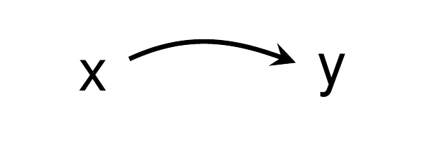
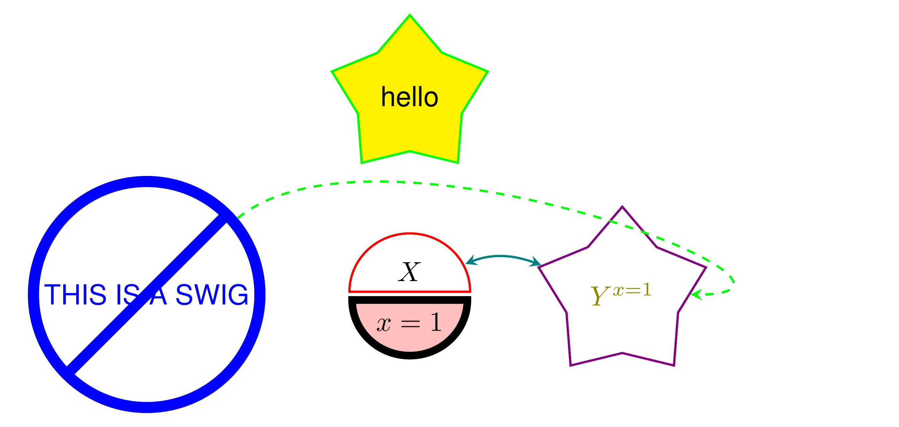
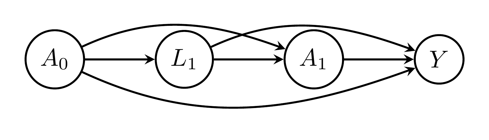

<!-- README.md is generated from README.Rmd. Please edit that file -->

# Examples

``` r
library(dagtex)

dagtex() %>% 
  add_node("x") %>% 
  add_node("y") %>% 
  add_edge("x", "y", is_curved = TRUE)
```



``` r

dagtex() %>% 
  add_node("u1") %>% 
  add_node("l") %>% 
  add_node("a") %>% 
  add_node("y") %>% 
  add_node("u2", below = "u1") %>% 
  add_node("u3", below = "l") %>% 
  add_edge("u1", "l") %>% 
  add_edge("l", "a") %>% 
  add_edge("u1", "y", is_curved = TRUE, annotate = annotate_edge("wow")) %>% 
  add_edge("l", "y", is_curved = TRUE) %>%
  add_edge("u2", "l", start_position = "north", end_position = "south") %>% 
  add_edge("u2", "a", start_position = "north", end_position = "south") %>% 
  add_edge("u3", "a", start_position = "north", end_position = "south") %>% 
  add_edge("u3", "y", start_position = "north", end_position = "south")
```


``` r

dagtex(.node_options = list(shape = "star"),
       .swig_options = list(gap = "3pt", line_color_upper = "red", split = "h",
                            fill_color_lower = "pink", line_width_lower = 2.75),
       .edge_options = list(linetype = "dashed", color = "green")) %>%
  add_node("THIS IS A SWIG",
           .options = list(shape = "forbidden sign", color = "blue", line_width = 4)) %>%
  add_swig_node(.left = "$X$", .right = "$x = 1$") %>%
  add_node("$Y^{x = 1}$",
           .options = list(color = "violet", text = "olive")) %>%
  add_edge("$x = 1$", "$Y^{x = 1}$", curve = "up", is_double_arrow = TRUE,
           .options = list(color = "teal", linetype = "solid")) %>%
  add_edge(1, 3, curve_in_degree = 0, curve_out_degree = 40) %>%
  add_node("hello", above = 2, .options = list(fill = "yellow"))
```



``` r

dagtex(.node_options = list(shape = "circle")) %>%
  add_node("$A_0$") %>%
  add_node("$L_1$") %>%
  add_node("$A_1$") %>%
  add_node("$Y$") %>%
  add_edges(.from = "$A_0$", .to = c("$L_1$","$A_1$", "$Y$")) %>%
  add_edges(.from = "$L_1$", .to = c("$A_1$", "$Y$")) %>%
  add_edge(.from = "$A_1$", .to = "$Y$")
```



``` r

dagtex(.node_options = list(shape = "ellipse"),
       .swig_options = list(gap = "3pt", line_color_right = "red")) %>%
  add_nodes(list(c("$A_0$", "$a_0$"), "$L_1$", c("$A_1$", "$a_1$"), "$Y$")) %>%
  add_edges(.from = "$a_0$", .to = c("$L_1$","$A_1$", "$Y$")) %>%
  add_edges(.from = "$L_1$", .to = c("$A_1$", "$Y$")) %>%
  add_edge(.from = "$a_1$", .to = "$Y$")
```


