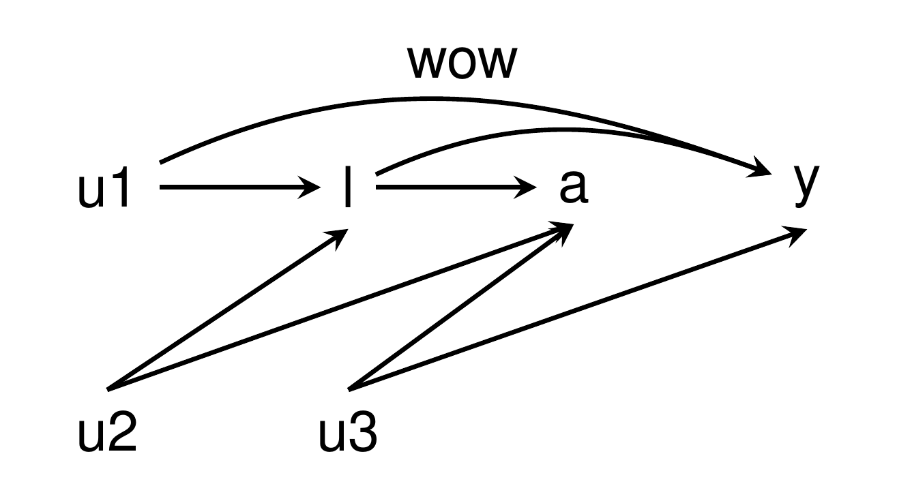
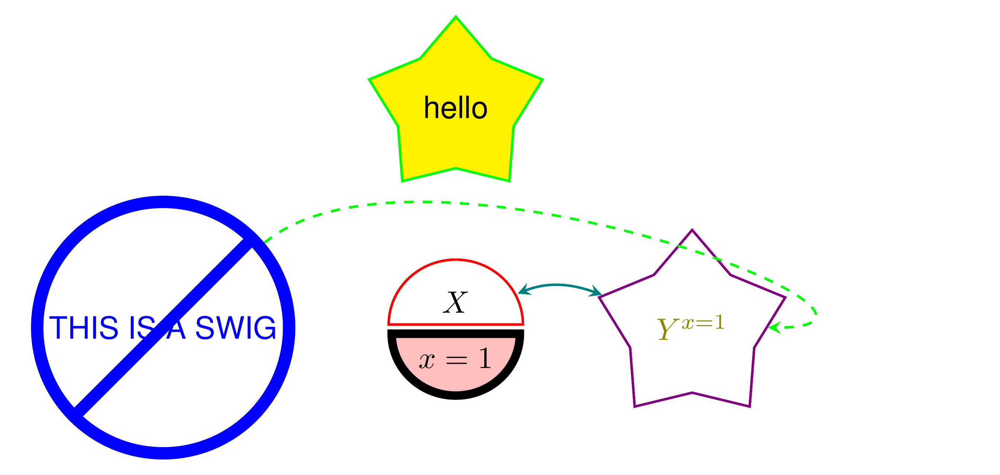
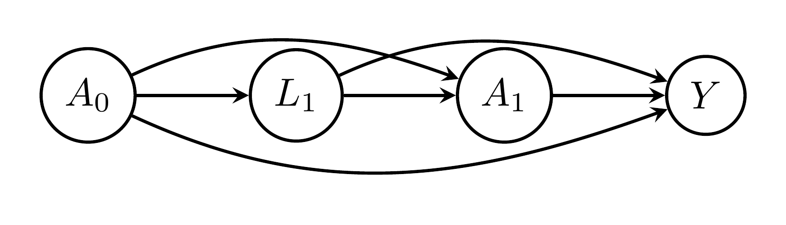
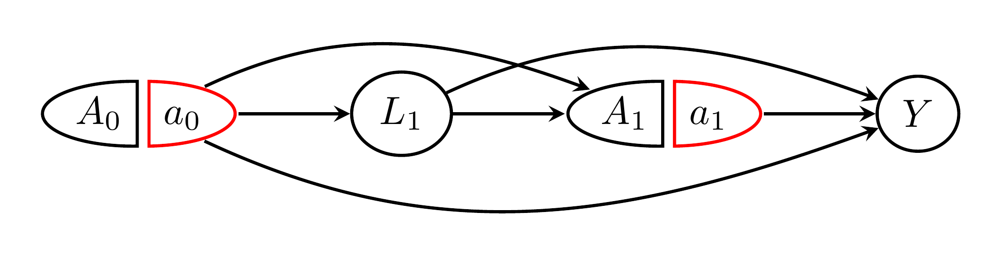

<!-- README.md is generated from README.Rmd. Please edit that file -->

# Installation

This is a fork of [Malcolm Barrett’s
dagtex](https://github.com/malcolmbarrett/dagtex/) that I am working on.
It is not yet on CRAN, but in the meantime you can install this
development version:

``` r
install.packages("remotes")
remotes::install_github("louisahsmith/dagtex")
```

The package converts R code into [TikZ
code](https://en.wikipedia.org/wiki/PGF/TikZ), language for producing
vector graphics. If you want to actually see the graphs, either in the
viewer window or in an RMarkdown document, you must have TeX installed.
The easiest way to do so is with the [R package
`tinytex`](https://yihui.org/tinytex/) by Yihui Xie. The [R package
`texPreview`](https://yonicd.github.io/texPreview/) is used to show
graphs in the viewer, as well as in non-pdf RMarkdown documents.

SWIGs are drawn using Thomas Richardson’s [TikZ shapes
library](https://www.stat.washington.edu/tsr/website/documents/2018/tikz-for-swigs/swig-examples.pdf).
The source code for this library is in `inst/tex`. Because it is not
part of the TikZ distribution, it must be installed manually, or the
`.tex` file must be included in the user’s working directory when it is
called. If you have installed LaTeX via `tinytex` or another TeXLive
distribution, you can use the `dagtex::install_swigs()` function to
attempt to place the TikZ library in the appropriate directory on your
computer and tell TeX where it is. No guarantees\!

# Examples

``` r
library(dagtex)

dagtex() %>% 
  add_node("x") %>% 
  add_node("y") %>% 
  add_edge("x", "y", is_curved = TRUE)
```


``` r

dagtex() %>% 
  add_node("u1") %>% 
  add_node("l") %>% 
  add_node("a") %>% 
  add_node("y") %>% 
  add_node("u2", below = "u1") %>% 
  add_node("u3", below = "l") %>% 
  add_edge("u1", "l") %>% 
  add_edge("l", "a") %>% 
  add_edge("u1", "y", is_curved = TRUE, annotate = annotate_edge("wow")) %>% 
  add_edge("l", "y", is_curved = TRUE) %>%
  add_edge("u2", "l", start_position = "north", end_position = "south") %>% 
  add_edge("u2", "a", start_position = "north", end_position = "south") %>% 
  add_edge("u3", "a", start_position = "north", end_position = "south") %>% 
  add_edge("u3", "y", start_position = "north", end_position = "south")
```



``` r

dagtex(.node_options = list(shape = "star"),
       .swig_options = list(gap = "3pt", line_color_upper = "red", split = "h",
                            fill_color_lower = "pink", line_width_lower = 2.75),
       .edge_options = list(linetype = "dashed", color = "green")) %>%
  add_node("THIS IS A SWIG",
           .options = list(shape = "forbidden sign", color = "blue", line_width = 4)) %>%
  add_swig_node(.left = "$X$", .right = "$x = 1$") %>%
  add_node("$Y^{x = 1}$",
           .options = list(color = "violet", text = "olive")) %>%
  add_edge("$x = 1$", "$Y^{x = 1}$", curve = "up", is_double_arrow = TRUE,
           .options = list(color = "teal", linetype = "solid")) %>%
  add_edge(1, 3, curve_in_degree = 0, curve_out_degree = 40) %>%
  add_node("hello", above = 2, .options = list(fill = "yellow"))
```



``` r

dagtex(.node_options = list(shape = "circle")) %>%
  add_node("$A_0$") %>%
  add_node("$L_1$") %>%
  add_node("$A_1$") %>%
  add_node("$Y$") %>%
  add_many_edges(.from = "$A_0$", .to = c("$L_1$","$A_1$", "$Y$")) %>%
  add_many_edges(.from = "$L_1$", .to = c("$A_1$", "$Y$")) %>%
  add_edge(.from = "$A_1$", .to = "$Y$")
```



``` r

dagtex(.node_options = list(shape = "ellipse"),
       .swig_options = list(gap = "3pt", line_color_right = "red")) %>%
  add_many_nodes(list(c("$A_0$", "$a_0$"), "$L_1$", c("$A_1$", "$a_1$"), "$Y$")) %>%
  add_many_edges(.from = "$a_0$", .to = c("$L_1$","$A_1$", "$Y$")) %>%
  add_many_edges(.from = "$L_1$", .to = c("$A_1$", "$Y$")) %>%
  add_edge(.from = "$a_1$", .to = "$Y$")
```


